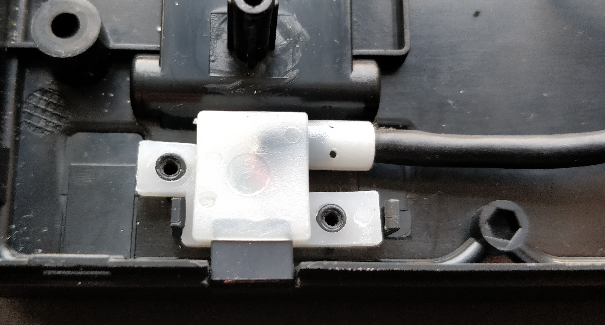

# CM Keyboard USB Breakout

Cooler Master keyboards come with a pretty terrible little JST-Micro USB breakout.  Not only are Micro USB connectors inferior in general terms of strength, longevity and reversability, but their implementation also does not play nicely with many 3rd party cables.

It is the aim of this project to create an open source alternative using a better standard connector (probably USB-C, but maybe also Mini USB, if it fits)

A list of keyboards that use the same breakout:
* Novatouch
* Quickfire Rapid-i
* Masterkeys series (Light and Pro in various flavours)
* Possibly others

 

Note that the QFRi and Novatouch breakouts are the same, but the JST is wired in the reverse order.

## Dimensions

## Possible Alternative

It is possible that a similar Ducky USB-C could be used or modified for use

